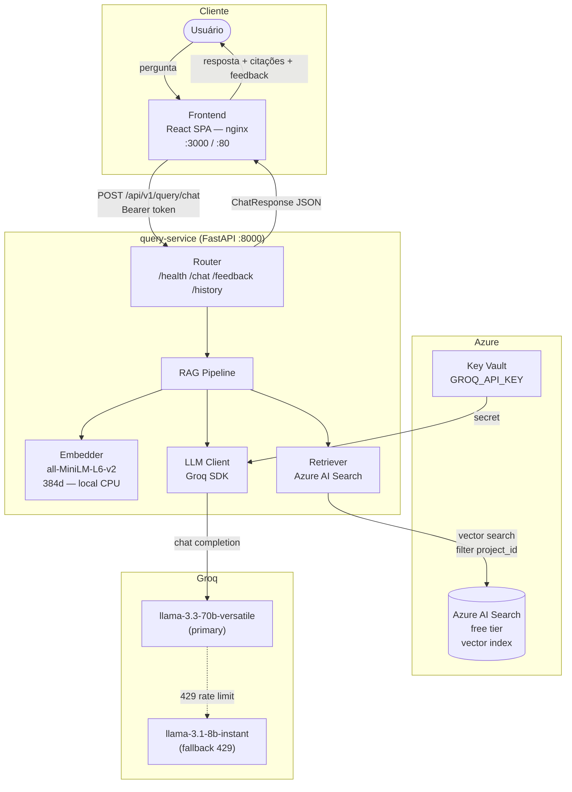

# DocAI — Módulo de Consulta (Chat RAG)

> **Disciplina:** Engenharia de Software com Microsserviços — Mackenzie 2026/1  
> **Versão:** 1.1 | Stack: FastAPI · React · Groq free tier · Azure AI Search · Terraform · Docker

Chat de documentação baseado em **Retrieval-Augmented Generation (RAG)**: o usuário faz perguntas em linguagem natural sobre os artefatos do projeto e a IA responde com base nos documentos indexados, citando as fontes.

---

## Arquitetura do Sistema



---

## Pipeline RAG — Fluxo Detalhado

```mermaid
sequenceDiagram
    actor U as Usuário
    participant F as Frontend
    participant B as Backend (FastAPI)
    participant E as Embedder (local)
    participant S as Azure AI Search
    participant G as Groq API

    U->>F: pergunta em linguagem natural
    F->>B: POST /api/v1/query/chat<br/>{project_id, session_id, message}

    B->>E: embed(message)
    Note over E: all-MiniLM-L6-v2<br/>sem chamada de rede
    E-->>B: vetor float[384]

    B->>S: vector search<br/>filter: project_id eq '...'<br/>top_k=5
    S-->>B: chunks relevantes + scores

    alt nenhum chunk encontrado
        B-->>F: 404 PROJECT_NOT_FOUND
    end

## Variáveis de Ambiente

### Backend (`query-service/.env`)

| Variável | Obrigatória | Padrão | Descrição |
|---|---|---|---|
| `GROQ_API_KEY` | Sim | — | Chave da API Groq (console.groq.com) |
| `AZURE_SEARCH_ENDPOINT` | Sim | — | URL do Azure AI Search |
| `AZURE_SEARCH_KEY` | Sim | — | Admin key do Azure AI Search |
| `AZURE_SEARCH_INDEX` | Não | `documents` | Nome do índice vetorial |
| `PRIMARY_LLM_MODEL` | Não | `llama-3.3-70b-versatile` | LLM principal |
| `FALLBACK_LLM_MODEL` | Não | `llama-3.1-8b-instant` | LLM fallback no 429 |
| `BEARER_TOKEN` | Não | `dev-token` | Token de autenticação interno |
| `TOP_K` | Não | `5` | Chunks a recuperar por query |
| `MAX_CONTEXT_TOKENS` | Não | `2000` | Limite de tokens no contexto RAG |
| `MAX_HISTORY_TURNS` | Não | `5` | Turnos de histórico enviados ao LLM |

### Frontend (`frontend/.env.local`)

| Variável | Padrão | Descrição |
|---|---|---|
| `VITE_PROJECT_ID` | `ecommerce-api` | ID do projeto consultado (deve coincidir com o usado na indexação) |
| `VITE_BEARER_TOKEN` | `dev-token` | Token Bearer enviado ao backend |

---

## API Reference

### Endpoints

| Método | Endpoint | Auth | Descrição |
|---|---|---|---|
| `GET` | `/api/v1/query/health` | Nenhuma | Liveness probe |
| `POST` | `/api/v1/query/chat` | Bearer | Envia pergunta → resposta RAG |
| `POST` | `/api/v1/query/feedback` | Bearer | Registra avaliação (👍 / 👎) |
| `GET` | `/api/v1/query/history/{session_id}` | Bearer | Histórico da sessão |
| `DELETE` | `/api/v1/query/history/{session_id}` | Bearer | Limpa sessão |

### Exemplo — Chat

```bash
curl -X POST http://localhost:8000/api/v1/query/chat \
  -H "Content-Type: application/json" \
  -H "Authorization: Bearer dev-token" \
  -d '{
    "project_id": "ecommerce-api",
    "session_id": "550e8400-e29b-41d4-a716-446655440000",
    "message": "Qual é a arquitetura do sistema?",
    "top_k": 5
  }'
```

```json
{
  "session_id": "550e8400-e29b-41d4-a716-446655440000",
  "answer": "O sistema usa arquitetura de microserviços com...",
  "model_used": "llama-3.3-70b-versatile",
  "sources": [
    { "document_id": "doc-1", "file_name": "arquitetura.pdf", "chunk_index": 0, "score": 0.94 }
  ],
  "latency_ms": 1240
}
```

### Exemplo — Feedback

```bash
curl -X POST http://localhost:8000/api/v1/query/feedback \
  -H "Content-Type: application/json" \
  -H "Authorization: Bearer dev-token" \
  -d '{
    "session_id": "550e8400-e29b-41d4-a716-446655440000",
    "message_id": "ai-1713312000000",
    "rating": "positive"
  }'
```

---

## Integrações com Outros Módulos

### Módulo de Ingestão (grupo responsável pela indexação)

O `query-service` consome documentos indexados pelo módulo de Ingestão no Azure AI Search. **O contrato de schema deve ser respeitado:**

```json
{
  "project_id": "string (UUID do projeto)",
  "document_id": "string (UUID do documento)",
  "file_name":   "string (ex: arquitetura.pdf)",
  "chunk_index": "integer",
  "chunk_text":  "string (conteúdo do chunk)",
  "embedding":   "float[384] — gerado com all-MiniLM-L6-v2"
}
```

> **Atenção:** O modelo de embedding **deve ser idêntico**: `all-MiniLM-L6-v2` (384 dimensões). Modelos diferentes geram vetores incompatíveis.

### Módulo de Gerenciamento (autenticação)

O campo `BEARER_TOKEN` é um placeholder para integração futura. Quando o módulo de Gerenciamento fornecer JWT:

1. Substituir a validação em `app/routers/query.py → _verify_token()`
2. Validar o JWT com a chave pública fornecida pelo módulo de Gerenciamento
3. Extrair `project_id` e permissões do payload do token se necessário

---

## Documentação Adicional

| Documento | Conteúdo |
|---|---|
| [`docs/TESTING.md`](docs/TESTING.md) | Manual completo de testes locais (pytest, Docker, curl) |
| [`docs/DEPLOY.md`](docs/DEPLOY.md) | Deploy em produção: Terraform + GitHub Actions + Azure |
| [`docs/PRD.md`](docs/PRD.md) | Requisitos técnicos completos (v1.1) |

---

## Stack Completa

| Camada | Tecnologia |
|---|---|
| Frontend | React 18 · TypeScript · Vite 6 · Tailwind CSS v4 · shadcn/ui |
| Backend | Python 3.12 · FastAPI · pydantic-settings · uvicorn |
| LLM | Groq API — llama-3.3-70b-versatile (free tier, ~300 t/s) |
| Embeddings | sentence-transformers all-MiniLM-L6-v2 · 384d · local CPU |
| Vector DB | Azure AI Search free tier (50 MB, 3 índices) |
| Infraestrutura | Azure Container Apps · ACR · Key Vault · Storage |
| IaC | Terraform 3.90 · azurerm provider |
| CI/CD | GitHub Actions (push → main → prod direto) |
| Container | Docker multi-stage · nginx 1.27 |

---

*DocAI — Módulo de Consulta | Mackenzie 2026/1 | v1.1*
