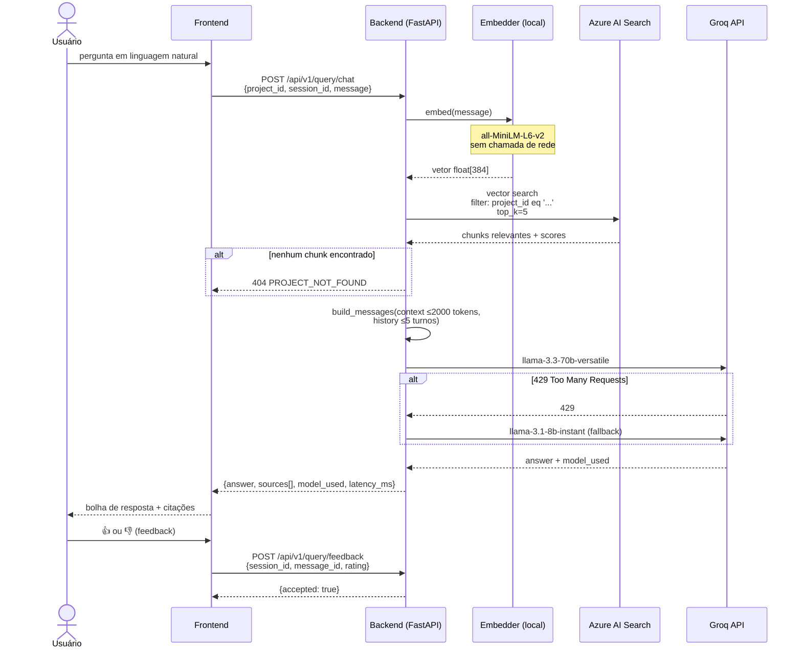
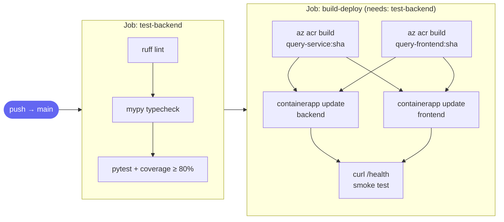

# DocAI — Módulo de Consulta (Chat RAG)

> **Disciplina:** Engenharia de Software com Microsserviços — Mackenzie 2026/1  
> **Versão:** 1.1 | Stack: FastAPI · React · Groq free tier · Azure AI Search · Terraform · Docker

Chat de documentação baseado em **Retrieval-Augmented Generation (RAG)**: o usuário faz perguntas em linguagem natural sobre os artefatos do projeto e a IA responde com base nos documentos indexados, citando as fontes.

---

## Arquitetura do Sistema


---

## Pipeline RAG — Fluxo Detalhado



---

## Pipeline CI/CD



---

## Estrutura do Repositório

```
Projeto-Engenharia-de-Software/
│
├── frontend/                      # React 18 + TypeScript + Vite 6 + Tailwind v4
│   ├── app/                       # Entry point e estilos globais
│   ├── hooks/                     # useChat (estado + session management)
│   ├── models/                    # Tipos: Message, CitationSource, Project…
│   ├── services/                  # chatService.ts → fetch real; projectService.ts
│   ├── utils/                     # cn, formatters
│   └── views/
│       ├── layouts/               # DocAISidebar
│       └── components/
│           ├── ChatArea/          # ChatArea, ChatMessages, ChatInput
│           ├── MessageBubble.tsx  # Bolha com citações + FeedbackButtons
│           ├── FeedbackButtons.tsx# 👍 👎 integrado ao backend
│           └── …                  # CitationCard, SprintStoriesCard, …
│
├── query-service/                 # FastAPI — RAG backend
│   ├── app/
│   │   ├── config.py              # pydantic-settings
│   │   ├── main.py                # FastAPI factory + CORS + lifespan
│   │   ├── routers/query.py       # Todos os endpoints
│   │   ├── schemas/chat.py        # Pydantic models
│   │   └── services/
│   │       ├── embedder.py        # sentence-transformers (local)
│   │       ├── llm_client.py      # Groq SDK + fallback automático
│   │       ├── prompt_builder.py  # Monta mensagens com contexto
│   │       ├── retriever.py       # Azure AI Search client
│   │       └── rag_pipeline.py    # Orquestrador dos 8 passos
│   ├── tests/
│   │   ├── unit/                  # test_schemas, test_llm_client, test_embedder…
│   │   └── integration/           # test_endpoints (todos os cenários do PRD)
│   ├── Dockerfile                 # multi-stage Python 3.12-slim
│   ├── requirements.txt
│   ├── requirements-dev.txt
│   └── pyproject.toml             # pytest + ruff + mypy
│
├── terraform/                     # IaC — provisionamento Azure do zero
│   ├── main.tf                    # Todos os recursos (RG, ACR, Search, KV, ContainerApps…)
│   ├── variables.tf
│   ├── outputs.tf
│   └── terraform.tfvars.example
│
├── docker/
│   └── nginx.conf                 # Proxy /api/ → backend + serve SPA
│
├── docs/
│   ├── PRD.md                     # Requisitos técnicos completos (v1.1)
│   ├── TESTING.md                 # Manual de testes locais
│   └── DEPLOY.md                  # Manual de deploy e Terraform
│
├── scripts/
│   ├── terraform-bootstrap.sh     # Cria remote state (executar 1x)
│   └── health-check.sh            # Valida backend + frontend + RAG
│
├── .github/workflows/
│   └── ci-cd.yml                  # Pipeline único → produção
│
├── Dockerfile                     # Frontend: Node 20 → nginx (multi-stage); context = repo root
├── docker-compose.yml             # MVP local: backend + frontend
```

---

## Quick Start — MVP Local (Docker Compose)

> Requer: Docker 24+ e Docker Compose v2

```bash
# 1. Clone e entre na pasta
git clone <repo-url>
cd Projeto-Engenharia-de-Software

# 2. Configure as variáveis do backend
cp query-service/.env.example query-service/.env
# Edite query-service/.env:
#   GROQ_API_KEY=gsk_...        ← https://console.groq.com (sem cartão)
#   AZURE_SEARCH_ENDPOINT=...
#   AZURE_SEARCH_KEY=...

# 3. Suba os containers (primeira vez ~3–5 min para baixar o modelo de embedding)
docker compose up --build

# 4. Verifique
bash scripts/health-check.sh
```

| Serviço | URL |
|---|---|
| Frontend | http://localhost:3000 |
| Backend API | http://localhost:8000 |
| Swagger UI | http://localhost:8000/docs |
| Health | http://localhost:8000/api/v1/query/health |

---

## Desenvolvimento Local (sem Docker)

### Backend

```bash
cd query-service

# Ambiente virtual
python -m venv .venv
source .venv/bin/activate          # Windows: .venv\Scripts\activate

# Dependências
pip install -r requirements.txt -r requirements-dev.txt

# Variáveis de ambiente
cp .env.example .env               # preencher GROQ_API_KEY etc.

# Testes
pytest                             # unit + integration + coverage ≥ 80%

# Servidor de desenvolvimento
uvicorn app.main:app --reload --port 8000
```

### Frontend

```bash
cd frontend

cp .env.local.example .env.local   # ajustar VITE_PROJECT_ID / VITE_BEARER_TOKEN se necessário

npm install
npm run dev                        # http://localhost:5173
```

> O Vite proxia `/api/*` → `http://localhost:8000` automaticamente (configurado em `frontend/vite.config.ts`).

---

## Variáveis de Ambiente

### Backend (`query-service/.env`)

| Variável | Obrigatória | Padrão | Descrição |
|---|---|---|---|
| `GROQ_API_KEY` | Sim | — | Chave da API Groq (console.groq.com) |
| `AZURE_SEARCH_ENDPOINT` | Sim | — | URL do Azure AI Search |
| `AZURE_SEARCH_KEY` | Sim | — | Admin key do Azure AI Search |
| `AZURE_SEARCH_INDEX` | Não | `documents` | Nome do índice vetorial |
| `PRIMARY_LLM_MODEL` | Não | `llama-3.3-70b-versatile` | LLM principal |
| `FALLBACK_LLM_MODEL` | Não | `llama-3.1-8b-instant` | LLM fallback no 429 |
| `BEARER_TOKEN` | Não | `dev-token` | Token de autenticação interno |
| `TOP_K` | Não | `5` | Chunks a recuperar por query |
| `MAX_CONTEXT_TOKENS` | Não | `2000` | Limite de tokens no contexto RAG |
| `MAX_HISTORY_TURNS` | Não | `5` | Turnos de histórico enviados ao LLM |

### Frontend (`frontend/.env.local`)

| Variável | Padrão | Descrição |
|---|---|---|
| `VITE_PROJECT_ID` | `ecommerce-api` | ID do projeto consultado (deve coincidir com o usado na indexação) |
| `VITE_BEARER_TOKEN` | `dev-token` | Token Bearer enviado ao backend |

---

## API Reference

### Endpoints

| Método | Endpoint | Auth | Descrição |
|---|---|---|---|
| `GET` | `/api/v1/query/health` | Nenhuma | Liveness probe |
| `POST` | `/api/v1/query/chat` | Bearer | Envia pergunta → resposta RAG |
| `POST` | `/api/v1/query/feedback` | Bearer | Registra avaliação (👍 / 👎) |
| `GET` | `/api/v1/query/history/{session_id}` | Bearer | Histórico da sessão |
| `DELETE` | `/api/v1/query/history/{session_id}` | Bearer | Limpa sessão |

### Exemplo — Chat

```bash
curl -X POST http://localhost:8000/api/v1/query/chat \
  -H "Content-Type: application/json" \
  -H "Authorization: Bearer dev-token" \
  -d '{
    "project_id": "ecommerce-api",
    "session_id": "550e8400-e29b-41d4-a716-446655440000",
    "message": "Qual é a arquitetura do sistema?",
    "top_k": 5
  }'
```

```json
{
  "session_id": "550e8400-e29b-41d4-a716-446655440000",
  "answer": "O sistema usa arquitetura de microserviços com...",
  "model_used": "llama-3.3-70b-versatile",
  "sources": [
    { "document_id": "doc-1", "file_name": "arquitetura.pdf", "chunk_index": 0, "score": 0.94 }
  ],
  "latency_ms": 1240
}
```

### Exemplo — Feedback

```bash
curl -X POST http://localhost:8000/api/v1/query/feedback \
  -H "Content-Type: application/json" \
  -H "Authorization: Bearer dev-token" \
  -d '{
    "session_id": "550e8400-e29b-41d4-a716-446655440000",
    "message_id": "ai-1713312000000",
    "rating": "positive"
  }'
```

---

## Integrações com Outros Módulos

### Módulo de Ingestão (grupo responsável pela indexação)

O `query-service` consome documentos indexados pelo módulo de Ingestão no Azure AI Search. **O contrato de schema deve ser respeitado:**

```json
{
  "project_id": "string (UUID do projeto)",
  "document_id": "string (UUID do documento)",
  "file_name":   "string (ex: arquitetura.pdf)",
  "chunk_index": "integer",
  "chunk_text":  "string (conteúdo do chunk)",
  "embedding":   "float[384] — gerado com all-MiniLM-L6-v2"
}
```

> **Atenção:** O modelo de embedding **deve ser idêntico**: `all-MiniLM-L6-v2` (384 dimensões). Modelos diferentes geram vetores incompatíveis.

### Módulo de Gerenciamento (autenticação)

O campo `BEARER_TOKEN` é um placeholder para integração futura. Quando o módulo de Gerenciamento fornecer JWT:

1. Substituir a validação em `app/routers/query.py → _verify_token()`
2. Validar o JWT com a chave pública fornecida pelo módulo de Gerenciamento
3. Extrair `project_id` e permissões do payload do token se necessário

---

## Documentação Adicional

| Documento | Conteúdo |
|---|---|
| [`docs/TESTING.md`](docs/TESTING.md) | Manual completo de testes locais (pytest, Docker, curl) |
| [`docs/DEPLOY.md`](docs/DEPLOY.md) | Deploy em produção: Terraform + GitHub Actions + Azure |
| [`docs/PRD.md`](docs/PRD.md) | Requisitos técnicos completos (v1.1) |

---

## Stack Completa

| Camada | Tecnologia |
|---|---|
| Frontend | React 18 · TypeScript · Vite 6 · Tailwind CSS v4 · shadcn/ui |
| Backend | Python 3.12 · FastAPI · pydantic-settings · uvicorn |
| LLM | Groq API — llama-3.3-70b-versatile (free tier, ~300 t/s) |
| Embeddings | sentence-transformers all-MiniLM-L6-v2 · 384d · local CPU |
| Vector DB | Azure AI Search free tier (50 MB, 3 índices) |
| Infraestrutura | Azure Container Apps · ACR · Key Vault · Storage |
| IaC | Terraform 3.90 · azurerm provider |
| CI/CD | GitHub Actions (push → main → prod direto) |
| Container | Docker multi-stage · nginx 1.27 |

---

## Estrutura do projeto

```
frontend/
├── main.tsx                          # Entry point
├── app/
│   ├── App.tsx                       # Composição raiz
│   └── styles/                       # CSS global, tema e fontes
├── views/
│   ├── layouts/
│   │   └── DocAISidebar.tsx          # Navegação lateral
│   └── components/
│       ├── ChatArea/
│       │   ├── index.tsx             # Orquestra o chat via useChat
│       │   ├── ChatMessages.tsx      # Lista de mensagens
│       │   └── ChatInput.tsx         # Input + botão enviar
│       ├── ConsultationHeader.tsx    # Header com status e ações
│       ├── MessageBubble.tsx         # Bolha de mensagem (AI / usuário)
│       ├── SuggestedQuestions.tsx    # Perguntas clicáveis
│       ├── CitationCard.tsx          # Card de fonte citada
│       ├── SprintStoriesCard.tsx     # Cards de histórias do sprint
│       ├── AIImageResponse.tsx       # Card visual de arquitetura
│       ├── ProjectMaterialsPanel.tsx # Painel lateral de materiais
│       ├── MaterialCard.tsx          # Card individual de material
│       ├── TypingIndicator.tsx       # Indicador de digitação da IA
│       └── InlineDiagram.tsx         # Diagrama de arquitetura inline
├── hooks/
│   ├── useChat.ts                    # Estado e lógica do chat
│   └── useMaterials.ts               # Estado do painel de materiais
├── services/
│   ├── chatService.ts                # Mock da IA com detecção de intenção
│   └── projectService.ts             # Dados mockados do projeto
├── models/
│   ├── message.ts                    # Message, MessageRole
│   ├── project.ts                    # Project, ProjectMaterial, SprintStory
│   ├── citation.ts                   # CitationSource
│   └── chat.ts                       # AIResponsePayload
├── utils/
│   ├── cn.ts                         # Utilitário de className
│   └── formatters.ts                 # Formatação de data/hora
└── types/
    └── index.ts                      # Re-exports centralizados
```

---

## Como rodar localmente

**Pré-requisito:** Node.js 18+

```bash
# Instalar dependências
npm install

# Rodar em modo desenvolvimento
npm run dev
```

Acesse `http://localhost:5173` no navegador.

```bash
# Gerar build de produção
npm run build
```

---

## Arquitetura do sistema (frontend + backend)

Diagrama considerando o frontend atual e o backend publicado (query-service).

```mermaid
graph TB
    subgraph Cliente
        U([Usuário])
        FE["Frontend React (Vite SPA)"]
    end

    subgraph Backend["query-service (FastAPI :8000)"]
        R[Router /api/v1/query]
        RAG[RAG Pipeline]
        EMB[Embedder local (all-MiniLM-L6-v2)]
        RET[Retriever]
        LLM[LLM Client (Groq)]
        R --> RAG
        RAG --> EMB
        RAG --> RET
        RAG --> LLM
    end

    subgraph Azure
        SEARCH[(Azure AI Search)]
        KV[Key Vault]
    end

    subgraph Groq
        G70["llama-3.3-70b-versatile"]
        G8["llama-3.1-8b-instant (fallback)"]
    end

    U -->|pergunta| FE
    FE -->|"POST /api/v1/query/chat"| R
    RET -->|"vector search"| SEARCH
    LLM -->|"chat completion"| G70
    G70 -.->|"429"| G8
    KV -->|secret| LLM
    R -->|"resposta + citações"| FE
    FE -->|resposta| U
```

## Arquitetura de frontend

O projeto segue uma abordagem inspirada em **MVC adaptado para frontend moderno**:

| Camada | Responsabilidade |
|---|---|
| `views/` | Interface — páginas, layouts e componentes visuais |
| `hooks/` | Orquestração de lógica e estado (equivalente ao controller) |
| `models/` | Contratos de domínio e tipos centrais |
| `services/` | Comunicação com APIs externas e acesso a dados |
| `utils/` | Funções puras e helpers reutilizáveis |

Toda a lógica do chat vive em `useChat.ts`. Os componentes são puramente apresentacionais e recebem dados via props. A comunicação com a IA é abstraída em `chatService.ts`, com uma interface que não muda ao integrar o backend real.

---

## Perguntas suportadas pelo mock

As seguintes perguntas ativam respostas:

| Pergunta | Tipo de resposta |
|---|---|
| Resuma o projeto | Visão geral + card visual |
| Mostre a arquitetura da solução | Diagrama de camadas + card de arquitetura |
| Quais são as histórias do sprint atual? | Cards do Sprint 7 com status e pontuação |
| Como funciona a autenticação? | Explicação JWT + citações de auth-flow.md e swagger.yaml |
| Quais são os módulos principais? | Lista dos 4 microserviços + diagrama |
| Quais arquivos devo ler primeiro? | Guia de onboarding com ordem recomendada |
| Me mostre a documentação da API | Resumo OpenAPI + citação do swagger.yaml |
| Como está o banco de dados? | Resumo do schema PostgreSQL + citação do db-schema.sql |

Qualquer outra pergunta retorna uma resposta de fallback coerente.

---

## O que está mockado

| O quê | Onde |
|---|---|
| Resposta da IA | `services/chatService.ts` |
| Dados do projeto (nome, sprint, equipe) | `services/projectService.ts` |
| Lista de materiais (8 documentos) | `services/projectService.ts` |
| Citações e trechos de evidência | `services/chatService.ts` |
| Usuário logado | `views/layouts/DocAISidebar.tsx` |

---

## Integrando o backend

A arquitetura foi desenhada para que a substituição dos mocks seja cirúrgica — nenhum componente precisa mudar:

```ts
// services/chatService.ts

// Hoje (mock):
export async function sendMessage(query: string): Promise<AIResponsePayload> {
  await delay(1600);
  return RESPONSES[detectIntent(query)]();
}

// Com backend real, basta trocar o corpo da função:
export async function sendMessage(query: string): Promise<AIResponsePayload> {
  const res = await fetch('/api/chat', {
    method: 'POST',
    headers: { 'Content-Type': 'application/json' },
    body: JSON.stringify({ query }),
  });
  return res.json(); // mesmo formato AIResponsePayload
}
```

---

## Disciplina

Projeto desenvolvido para a disciplina de **Engenharia de Software**.
*DocAI — Módulo de Consulta | Mackenzie 2026/1 | v1.1*
