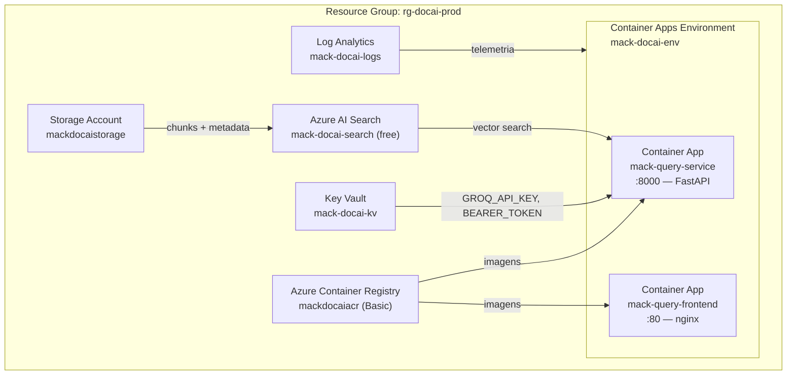

# Manual de Deploy — Terraform + GitHub Actions + Azure

Este documento cobre o provisionamento completo da infraestrutura Azure (do zero) e o deploy automático via CI/CD.

---

## Visão Geral da Infraestrutura



---

## Pré-requisitos

| Ferramenta | Versão | Instalação |
|---|---|---|
| Azure CLI | 2.57+ | [aka.ms/installazurecliwindows](https://aka.ms/installazurecliwindows) |
| Terraform | 1.7+ | [terraform.io/downloads](https://terraform.io/downloads) |
| Docker | 24+ | [docker.com](https://docker.com) |
| GitHub CLI (opcional) | 2.x | `winget install GitHub.cli` |

**Conta necessária:** Azure for Students (gratuito) — [azure.microsoft.com/free/students](https://azure.microsoft.com/free/students)

---

## 1. Bootstrap (executar uma única vez)

Este passo cria o Storage Account para guardar o estado remoto do Terraform.

```bash
# Configure as variáveis de ambiente antes de rodar
export AZURE_SUBSCRIPTION_ID="<sua-subscription-id>"  # az account show --query id
export PROJECT_PREFIX="mack"                          # prefixo curto, sem traços
export AZURE_LOCATION="eastus"

bash scripts/terraform-bootstrap.sh
```

O script executa:
1. `az login`
2. Cria Resource Group `rg-tfstate`
3. Cria Storage Account `${PREFIX}tfstate`
4. Cria container `tfstate`

Ao final, exibe o comando `terraform init` com todos os parâmetros de backend preenchidos.

---

## 2. Configurar variáveis do Terraform

```bash
cd terraform/
cp terraform.tfvars.example terraform.tfvars
```

Edite `terraform.tfvars` (nunca commite este arquivo):

```hcl
resource_group_name = "rg-docai-prod"
location            = "eastus"
project_prefix      = "mack"

# Obter em https://console.groq.com → API Keys
groq_api_key = "gsk_XXXXXXXXXXXXXXXXXXXXXXXXXXXXXXXX"

# Preenchido APÓS o primeiro apply (ver passo 4)
azure_search_key = ""

# Gerar com: openssl rand -hex 32
bearer_token = "XXXXXXXXXXXXXXXXXXXXXXXXXXXXXXXXXXXXXXXXXXXXXXXXXXXXXXXXXXXXXXXX"

vite_project_id = "ecommerce-api"
```

> **Segurança:** `terraform.tfvars` está no `.gitignore`. Nunca commite chaves ou senhas.

---

## 3. Inicializar o Terraform

```bash
cd terraform/

terraform init \
  -backend-config="resource_group_name=rg-tfstate" \
  -backend-config="storage_account_name=mackterraformstate" \
  -backend-config="container_name=tfstate" \
  -backend-config="key=docai.tfstate"
```

---

## 4. Primeiro apply (dois passos)

### Passo 4a — Provisionar infraestrutura base (sem Search key)

Na primeira execução, o `azure_search_key` ainda não existe. Deixe vazio e aplique:

```bash
terraform plan -var-file=terraform.tfvars
terraform apply -var-file=terraform.tfvars -auto-approve
```

Recursos criados: Resource Group, ACR, Storage, Azure AI Search, Key Vault, Log Analytics, Container Apps Environment, Container Apps (backend + frontend).

### Passo 4b — Obter a chave do Azure AI Search

```bash
az search admin-key show \
  --service-name mack-docai-search \
  --resource-group rg-docai-prod \
  --query primaryKey -o tsv
```

Adicione o valor ao `terraform.tfvars`:

```hcl
azure_search_key = "XXXXXXXXXXXXXXXXXXXXXXXXXXXXXXXX"
```

### Passo 4c — Re-aplicar para injetar a chave no Container App

```bash
terraform apply -var-file=terraform.tfvars -auto-approve
```

---

## 5. Verificar outputs do Terraform

```bash
terraform output
```

Saída esperada:

```
backend_url          = "https://mack-query-service.kindbeach-xxxxxxxx.eastus.azurecontainerapps.io"
frontend_url         = "https://mack-query-frontend.kindbeach-xxxxxxxx.eastus.azurecontainerapps.io"
acr_login_server     = "mackdocaiacr.azurecr.io"
acr_admin_username   = "mackdocaiacr"
search_endpoint      = "https://mack-docai-search.search.windows.net"
storage_account_name = "mackdocaistorage"
resource_group_name  = "rg-docai-prod"
```

---

## 6. Configurar Secrets do GitHub Actions

Navegue em: `GitHub → Repositório → Settings → Secrets and variables → Actions`

| Secret | Como obter |
|---|---|
| `AZURE_CREDENTIALS` | `az ad sp create-for-rbac --name "docai-cicd" --role Contributor --scopes /subscriptions/<ID> --sdk-auth` |
| `ACR_NAME` | `terraform output -raw acr_login_server \| cut -d'.' -f1` |
| `RG_NAME` | `terraform output -raw resource_group_name` |
| `BACKEND_APP_NAME` | `mack-query-service` (ou consultar no Portal Azure) |
| `FRONTEND_APP_NAME` | `mack-query-frontend` |
| `VITE_PROJECT_ID` | `ecommerce-api` (ou o ID do projeto real) |
| `VITE_BEARER_TOKEN` | Mesmo valor de `bearer_token` no `terraform.tfvars` |

### Criar o Service Principal

```bash
az ad sp create-for-rbac \
  --name "docai-cicd" \
  --role Contributor \
  --scopes /subscriptions/<SUBSCRIPTION_ID>/resourceGroups/rg-docai-prod \
  --sdk-auth
```

Copie o JSON completo e cole como o secret `AZURE_CREDENTIALS`.

---

## 7. Deploy Automático (CI/CD)

Com os secrets configurados, qualquer push para `main` executa automaticamente:

```
push → main
  └── test-backend (lint + mypy + pytest)
        └── build-deploy
              ├── az acr build query-service:sha
              ├── az acr build query-frontend:sha
              ├── containerapp update backend
              ├── containerapp update frontend
              └── curl /health (smoke test)
```

Acompanhe em: `GitHub → Repositório → Actions`

---

## 8. Deploy Manual (sem CI/CD)

### Build e push das imagens via ACR Tasks

```bash
# Login no ACR
az acr login --name mackdocaiacr

# Backend
az acr build \
  --registry mackdocaiacr \
  --image query-service:manual \
  ./query-service

# Frontend
az acr build \
  --registry mackdocaiacr \
  --image query-frontend:manual \
  --build-arg VITE_PROJECT_ID=ecommerce-api \
  --build-arg VITE_BEARER_TOKEN=<token> \
  .
```

### Atualizar os Container Apps

```bash
RG="rg-docai-prod"
ACR="mackdocaiacr.azurecr.io"

# Backend
az containerapp update \
  --name mack-query-service \
  --resource-group $RG \
  --image $ACR/query-service:manual

# Frontend
az containerapp update \
  --name mack-query-frontend \
  --resource-group $RG \
  --image $ACR/query-frontend:manual
```

---

## 9. Monitoramento e Logs

### Logs em tempo real

```bash
# Backend
az containerapp logs show \
  --name mack-query-service \
  --resource-group rg-docai-prod \
  --follow

# Frontend
az containerapp logs show \
  --name mack-query-frontend \
  --resource-group rg-docai-prod \
  --follow
```

### Status dos Container Apps

```bash
az containerapp show \
  --name mack-query-service \
  --resource-group rg-docai-prod \
  --query '{status:properties.runningStatus, replicas:properties.template.scale}' \
  -o json
```

### Health check em produção

```bash
BACKEND_URL=$(terraform output -raw backend_url)
FRONTEND_URL=$(terraform output -raw frontend_url)
BEARER_TOKEN="seu-token"

BACKEND_URL=$BACKEND_URL FRONTEND_URL=$FRONTEND_URL BEARER_TOKEN=$BEARER_TOKEN \
  bash scripts/health-check.sh
```

---

## 10. Destruir a Infraestrutura

> Use quando não estiver apresentando o projeto para economizar crédito Azure.

```bash
cd terraform/
terraform destroy -var-file=terraform.tfvars -auto-approve
```

> Os Container Apps escalam a **zero réplicas** automaticamente quando não há tráfego (configurado com `min_replicas = 0`). Isso minimiza custo mesmo sem destruir a infra.

---

## 11. Referência de Custos (Azure for Students)

| Recurso | Tier | Custo estimado |
|---|---|---|
| Container Apps (backend + frontend) | Consumption | ~$0/mês (free grant) |
| Container Registry | Basic | ~$5/mês |
| Azure AI Search | **Free** | $0/mês |
| Storage Account | LRS Standard | < $1/mês |
| Key Vault | Standard | ~$0/mês |
| Log Analytics | Pay-per-GB | ~$0 (< 5 GB/mês) |
| **Groq API** | **Free tier** | **$0** |
| **Total** | | **~$5–6/mês** |

---

## 12. Troubleshooting

| Problema | Causa provável | Solução |
|---|---|---|
| `terraform apply` falha em Key Vault | Nome já existe (soft-delete Azure) | Alterar `project_prefix` ou purgar: `az keyvault purge --name ...` |
| CI/CD falha em `az acr build` | Service Principal sem permissão no ACR | Adicionar role `AcrPush` ao SP: `az role assignment create --role AcrPush ...` |
| Container App não inicia | Variável de ambiente ausente | Verificar `az containerapp show ... --query 'properties.template.containers[0].env'` |
| `403 Forbidden` no Azure AI Search | Search key incorreta | Re-obter com `az search admin-key show` e re-aplicar Terraform |
| Smoke test falha após deploy | Container App em cold start | Aguardar 30–60s; o Container App escala de 0 para 1 réplica na primeira requisição |
| `terraform init` falha com backend | Storage Account não criado | Executar `scripts/terraform-bootstrap.sh` primeiro |
