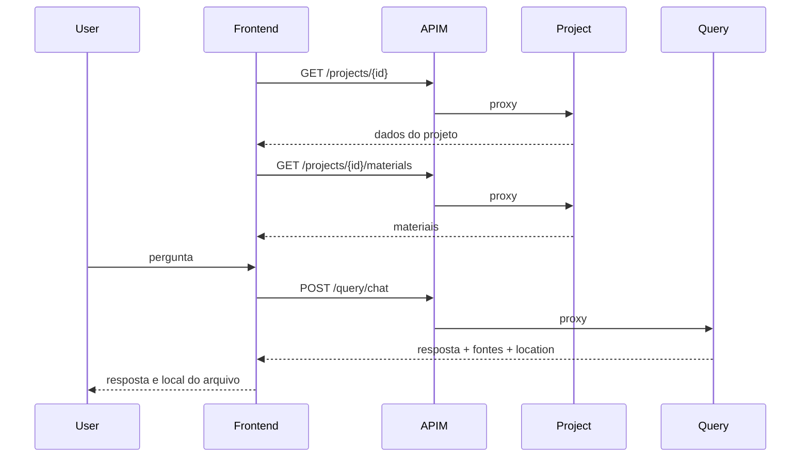

# docai-frontend

Frontend React/Vite do DocAI. Este repositorio consome somente a URL unica do
Azure API Management por `VITE_API_BASE_URL`. Nao ha mocks silenciosos: se o
backend estiver indisponivel, a aplicacao mostra um banner de erro de conexao.

## Arquitetura

```mermaid
flowchart LR
    Browser --> App[React App]
    App --> Chat[ChatArea/useChat]
    App --> Materials[useMaterials]
    Chat -->|POST /api/v1/query/chat| APIM[Azure API Management]
    Materials -->|GET /api/v1/projects/{id}/materials| APIM
    App -->|GET /api/v1/projects/{id}| APIM
    APIM --> Query[docai-query-service]
    APIM --> Project[docai-project-service]
```

## Fluxo De Uso



## Configuracao

| Variavel | Obrigatoria | Descricao |
| --- | --- | --- |
| `VITE_API_BASE_URL` | Sim | Base URL do API Management |
| `VITE_PROJECT_ID` | Sim | Projeto ativo |
| `VITE_BEARER_TOKEN` | MVP | Token dev |

Sem `VITE_API_BASE_URL`, o banner informa que o backend nao foi configurado.

## Estrutura

```text
app/                     # entrada visual
hooks/                   # useChat, useMaterials
models/                  # tipos de dominio frontend
services/                # clients HTTP reais, sem fallback mockado
views/components/        # componentes de UI
terraform/               # Azure Static Web App
```

## Execucao

```bash
npm ci
npm run dev
```

## Build

```bash
VITE_API_BASE_URL=https://<apim-host> npm run build
```

## Deploy

Terraform cria Azure Static Web App Free. O workflow de CD publica `dist/`.

```bash
scripts/terraform-bootstrap.sh
RUN_TERRAFORM_PLAN=true scripts/terraform-bootstrap.sh
```
