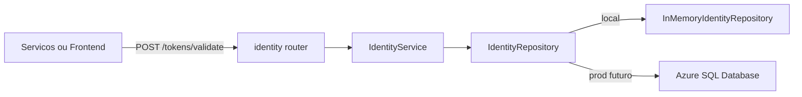
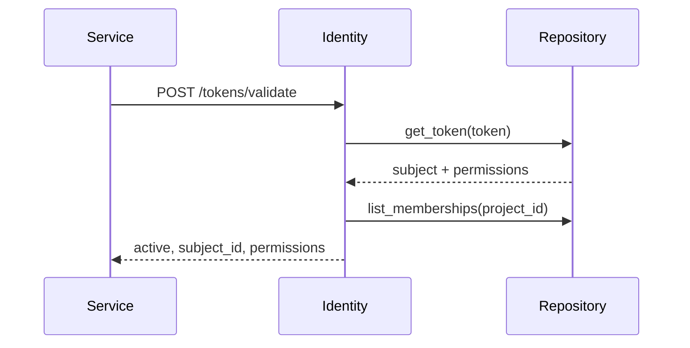
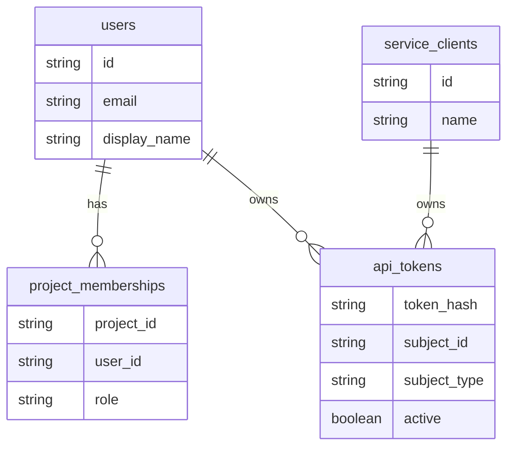
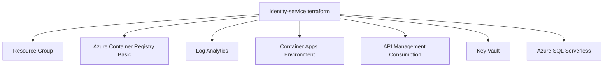

# docai-identity-service

Servico FastAPI responsavel por identidade simples no MVP: tokens dev/API key,
usuarios demo, service clients internos e memberships por projeto. Ele nao faz
login, senha, refresh token ou emissao JWT.

## Arquitetura



## Fluxo De Validacao



## Estrutura

```text
app/
  config.py
  dependencies.py
  domain.py                         # fachada compatibilidade
  main.py
  routers/identity.py
  schemas/identity.py
  repositories/identity_repository.py
  services/identity_service.py
```

## Endpoints

- `GET /api/v1/identity/health`
- `POST /api/v1/identity/tokens/validate`
- `GET /api/v1/identity/users`
- `GET /api/v1/identity/memberships`

## Modelo De Dados



## Azure Ownership



## Execucao Local

```bash
pip install -r requirements.txt -r requirements-dev.txt
uvicorn app.main:app --reload --port 8001
```

## Qualidade

```bash
ruff check app tests
mypy app
python -m pytest
```

## Terraform

```bash
export TF_VAR_sql_admin_password="..."
scripts/terraform-bootstrap.sh
RUN_TERRAFORM_PLAN=true scripts/terraform-bootstrap.sh
```

Remote state opcional: `TF_BACKEND_RESOURCE_GROUP`,
`TF_BACKEND_STORAGE_ACCOUNT`, `TF_BACKEND_CONTAINER`, `TF_BACKEND_KEY`.
