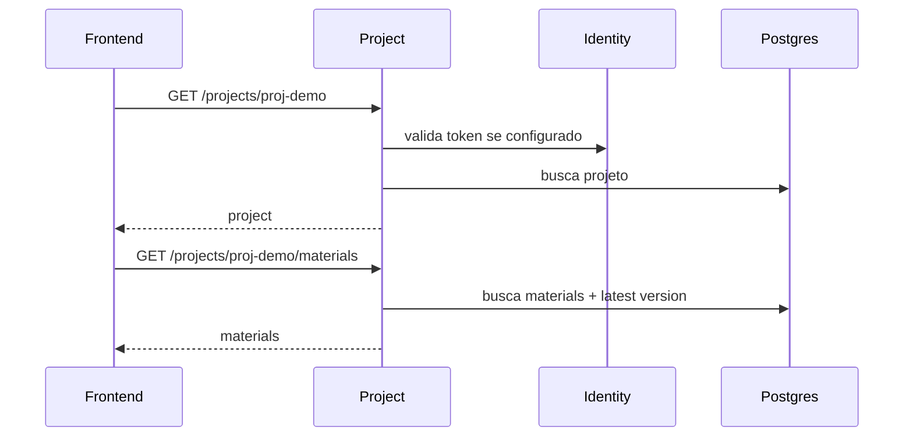
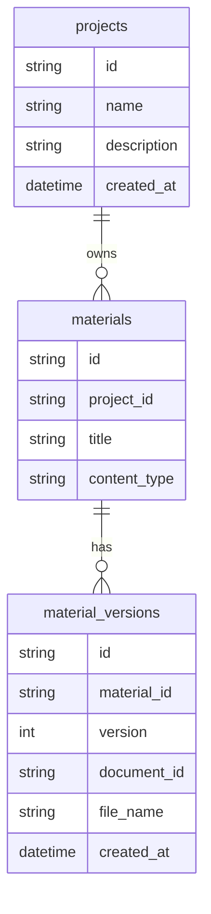

# docai-project-service

Servico FastAPI responsavel pelo catalogo de projetos, materiais e versoes de
materiais exibidos no frontend. Ele nao conhece chunks, embeddings, sessoes de
chat ou usuarios alem do token validado.

## Arquitetura

```mermaid
flowchart LR
    Frontend -->|GET /projects/{id}| API[projects router]
    Frontend -->|GET /projects/{id}/materials| API
    API --> AUTH[TokenValidator]
    AUTH -->|opcional| Identity[identity-service]
    API --> SVC[CatalogService]
    SVC --> REPO[ProjectRepository]
    REPO -->|local| MEM[InMemoryProjectRepository]
    REPO -->|prod| PG[PostgreSQL Flexible Server]
```

## Fluxo Do Frontend



## Estrutura

```text
app/
  config.py
  dependencies.py
  catalog.py                        # fachada compatibilidade
  main.py
  routers/projects.py
  schemas/project.py
  repositories/project_repository.py
  services/catalog_service.py
  services/token_validator.py
```

## Modelo De Dados



## Endpoints

- `GET /api/v1/projects/health`
- `GET /api/v1/projects`
- `GET /api/v1/projects/{project_id}`
- `GET /api/v1/projects/{project_id}/materials`

Endpoints de dominio exigem `Authorization: Bearer dev-token` no MVP.

## Execucao Local

```bash
pip install -r requirements.txt -r requirements-dev.txt
uvicorn app.main:app --reload --port 8002
```

## Qualidade

```bash
ruff check app tests
mypy app
python -m pytest
```

## Terraform

Cria PostgreSQL Flexible Server, database, Container App e rota APIM.

```bash
scripts/terraform-bootstrap.sh
RUN_TERRAFORM_PLAN=true scripts/terraform-bootstrap.sh
```
