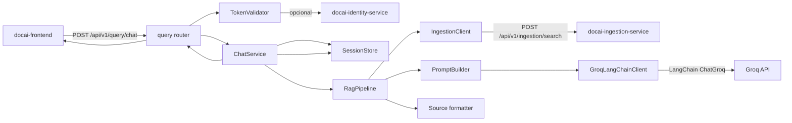
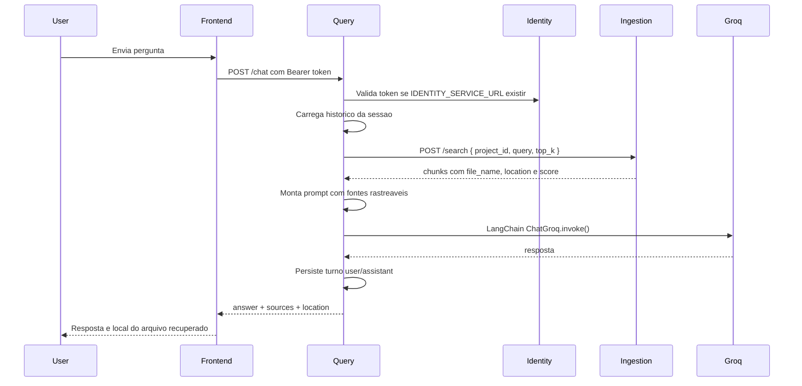
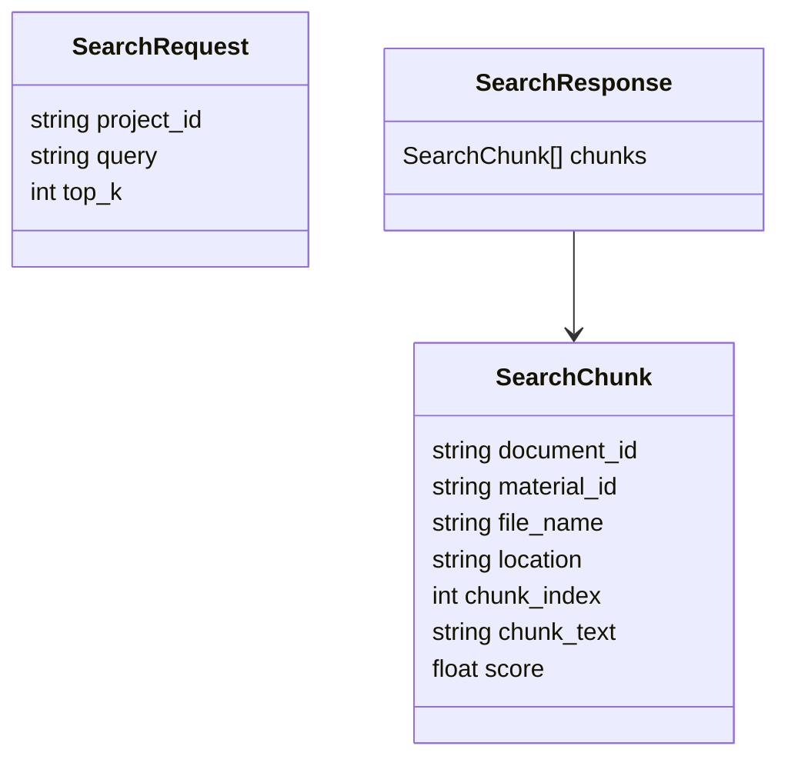

# docai-query-service

Servico FastAPI responsavel por consulta/chat RAG no DocAI. Este repositorio
deve evoluir isoladamente como o backend de orquestracao de conversas: ele
recebe a pergunta do frontend, valida o token simples, recupera historico,
consulta o `docai-ingestion-service`, monta o prompt com contexto rastreavel,
chama a LLM via LangChain/Groq, persiste a conversa e retorna resposta com
fontes.

Este servico nao gera embeddings, nao acessa Azure AI Search e nao le arquivos
diretamente. Qualquer recuperacao documental passa pelo contrato HTTP do
ingestion-service.

## Arquitetura



## Fluxo De Uso



## Estrutura

```text
app/
  config.py                     # variaveis de ambiente e defaults
  dependencies.py               # singletons in-memory e services
  main.py                       # factory FastAPI
  routers/
    query.py                    # endpoints HTTP, sem regra de negocio pesada
  schemas/
    chat.py                     # contratos request/response
  services/
    chat_service.py             # orquestra chat + historico
    feedback_service.py         # feedback in-memory, futuro Cosmos
    ingestion_client.py         # cliente HTTP para ingestion-service
    llm_client.py               # LangChain/Groq
    prompt_builder.py           # prompt, contexto e formatacao de fontes
    rag_pipeline.py             # pipeline RAG
    session_service.py          # historico in-memory, futuro Cosmos
    token_validator.py          # dev token + cache + identity-service opcional
tests/
  contract/                     # contrato query -> ingestion
  e2e/                          # teste real Groq opt-in
  integration/                  # HTTP FastAPI/HTTPX
  unit/                         # regras e clients mockados
```

## Contratos

### Chat

`POST /api/v1/query/chat`

```json
{
  "project_id": "proj-demo",
  "session_id": "sess-123",
  "message": "Como o DocAI esta dividido?",
  "top_k": 5
}
```

Resposta:

```json
{
  "session_id": "sess-123",
  "answer": "O DocAI esta dividido em...",
  "model_used": "llama-3.3-70b-versatile",
  "sources": [
    {
      "document_id": "doc-1",
      "material_id": "mat-architecture",
      "file_name": "architecture.md",
      "location": "architecture.md#chunk-7",
      "chunk_index": 7,
      "score": 0.99
    }
  ],
  "latency_ms": 1200
}
```

### Query -> Ingestion



## LangChain/Groq

O modulo `llm_client.py` usa `langchain-groq` quando instalado. Em ambientes
onde a dependencia ainda nao estiver presente, ha fallback OpenAI-compatible
para preservar testes e compatibilidade local, mas a imagem de producao deve
instalar `langchain-groq` via `requirements.txt`.

Modelos:

- Primario: `PRIMARY_LLM_MODEL`, default `llama-3.3-70b-versatile`
- Fallback: `FALLBACK_LLM_MODEL`, default `llama-3.1-8b-instant`

Fallback ocorre quando a chamada primaria retorna erro contendo `429`.

## Variaveis De Ambiente

| Variavel | Obrigatoria | Descricao |
| --- | --- | --- |
| `GROQ_API_KEY` | Sim em prod | Chave da API Groq |
| `INGESTION_SERVICE_URL` | Sim | URL interna do ingestion-service |
| `IDENTITY_SERVICE_URL` | Nao | Se definida, valida token no identity-service |
| `BEARER_TOKEN` | MVP local | Token dev aceito sem identity-service |
| `INTERNAL_SERVICE_TOKEN` | Sim | Token usado entre servicos |
| `TOKEN_CACHE_TTL_SECONDS` | Nao | TTL do cache de token |

## Execucao Local

```bash
python -m venv .venv
.venv/Scripts/activate
pip install -r requirements.txt -r requirements-dev.txt
uvicorn app.main:app --reload --port 8004
```

## Qualidade

```bash
ruff check app tests
mypy app
python -m pytest
```

## E2E Real Com Groq

O teste real nao grava segredo em arquivo e fica desligado por padrao:

```bash
set GROQ_API_KEY=<sua-chave>
set RUN_REAL_GROQ_E2E=true
python -m pytest tests/e2e/test_real_groq_rag.py --no-cov
```

## Terraform

Este repo cria:

- Azure Cosmos DB NoSQL
- Container App do query-service
- API Management route `/api/v1/query`

Bootstrap:

```bash
scripts/terraform-bootstrap.sh
RUN_TERRAFORM_PLAN=true scripts/terraform-bootstrap.sh
```

## Limites Conhecidos

- Historico e feedback ainda sao in-memory, mas isolados em services para troca
  por Cosmos DB.
- O token dev e aceitavel apenas para MVP.
- O E2E real depende de rede e custo de chamada Groq.
